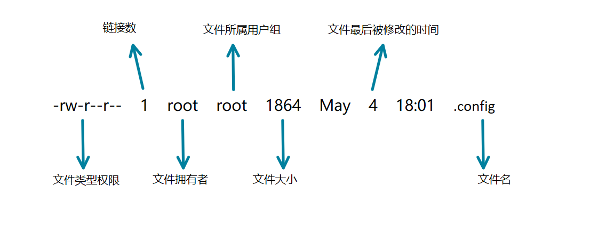
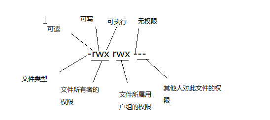

# 文件与目录权限

## 前言
在 Linux 系统中，文件与目录权限管理是保障系统安全和数据完整性的重要手段。了解文件属性以及如何修改文件权限，对于系统管理员和普通用户来说都至关重要。

## 一、文件属性
### 1.1 文件属性示意图


### 1.2 文件类型与权限
#### 1.2.1 文件类型标识
图一中，第 1 串字符代表这个文件的类型与权限。其中，第一个字符代表文件是目录、文件或链接文件等：
- `[d]` 代表目录
- `[-]` 代表文件
- `[l]` 代表链接文件

#### 1.2.2 权限组合

后九位字符中每三个字符为一组，且均为 `【rwx】` 的组合。第一组为文件拥有者的权限，第二组为文件所属用户组的权限，第三组为其他用户的权限。以第一组为例：
- `[r]` 代表 `read`，可读权限，权限值为 4，权限排名最低
- `[w]` 代表 `write`，可写权限，权限值为 2，权限排名居中
- `[x]` 代表 `execute`，可执行权限，权限值为 1，权限排名最高

**注意**：
- `rwx` 所在的位置或者说顺序是不会改变的，有权限就会显示字符，没有则用 `-` 表示。
- 此处要与第一个字符区分开。

### 1.3 其他属性
- **链接数**：图一中，第 2 串字符表示有多少个文件名链接到此节点。
- **拥有者账号名**：图一中，第 3 串字符表示这个文件的拥有者账号名。
- **所属用户组**：图一中，第 4 串字符表示这个文件的所属用户组。
- **文件大小**：图一中，第 5 串字符表示这个文件的大小（默认单位为 Bytes）。
- **创建或修改日期**：图一中，第 6 串字符表示这个文件的创建日期或者是最近的修改日期，若文件的修改时间距今太久，那么只会显示年月日。
- **文件名**：图一中，第 7 串字符表示文件名。文件名前面有 `[.]` 则表示该文件为隐藏文件，可用 `【ls】`、`【ls -a】` 及 `【ls -al】` 来查看。

**特殊说明**：对于文件夹来说，`[x]` 原本代表执行权限，但如果某个用户对于某个目录没有 `[x]` 的权限，则该用户无法进入该目录。

## 二、如何修改文件属性与权限
### 2.1 修改所属用户组
| 命令 | 作用 |
|:-:|:-:|
| `chgrp` | 修改文件所属用户组 |

```bash
chgrp   [-R]  账号名   dirname/filename
-R: 递归修改
```
