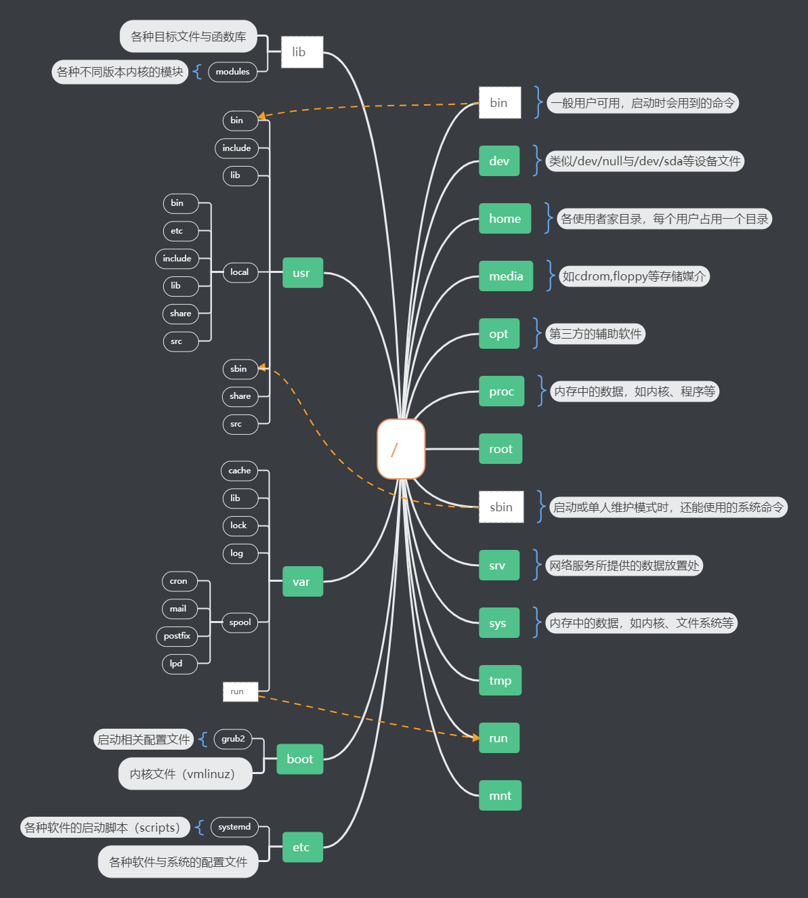
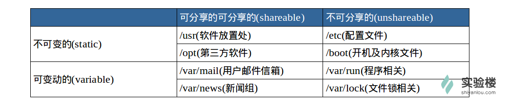
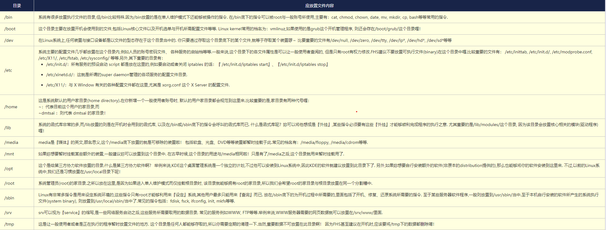
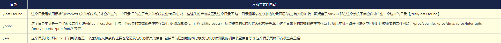
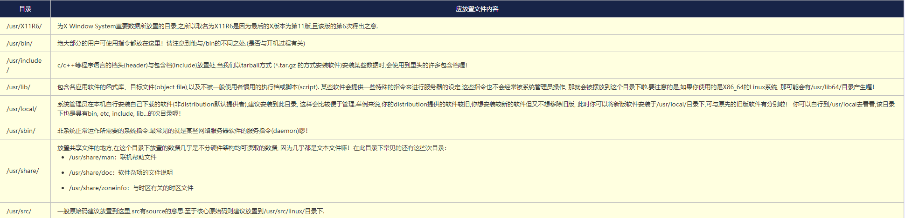
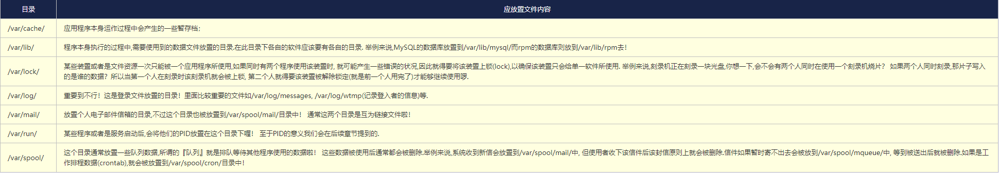

# Linux 根目录介绍

在 Linux 系统中，根目录（`/`）是整个文件系统的起始点，所有的文件和目录都挂载在根目录下。下面将详细介绍 Linux 各个主要目录的作用以及存放的内容，并结合相关图片进行说明。

## 目录树架构示意图

这张图展示了 Linux 文件系统的整体目录树架构，帮助我们从宏观上理解各个目录之间的层次关系。

## FHS 标准概述
FHS（Filesystem Hierarchy Standard）是 Linux 文件系统层次结构标准，它定义了 Linux 系统中各个目录的用途和内容。下面是 FHS 标准的相关图示。

这张图展示了 FHS 标准的整体框架，为我们后续理解各个目录的作用提供了基础。

## 主要目录介绍

### /bin
- **作用**：存放系统启动和运行时必需的可执行命令，这些命令在系统启动时就需要使用，即使文件系统没有完全挂载也能正常执行。
- **存放内容**：常见的命令如 `ls`、`cp`、`mv` 等。

### /sbin
- **作用**：存放系统管理员使用的系统管理命令，一般只有超级用户（root）才能执行。
- **存放内容**：例如 `shutdown`、`reboot`、`fdisk` 等。

### /etc
- **作用**：存放系统和应用程序的配置文件，这些文件用于控制系统的行为和应用程序的运行参数。
- **存放内容**：如 `passwd`、`group`、`fstab` 等。

### /var
- **作用**：存放经常变化的数据，如日志文件、邮件队列、数据库文件等。
- **存放内容**：日志文件位于 `/var/log` 目录下，邮件队列位于 `/var/spool/mail` 目录下。

### /tmp
- **作用**：临时文件目录，用于存放系统和应用程序在运行过程中产生的临时文件。系统重启时，该目录下的文件会被清空。
- **存放内容**：各种临时生成的文件和数据。

### /home
- **作用**：用户主目录，每个用户都有自己的主目录，用于存放用户的个人文件和配置。
- **存放内容**：用户的文档、图片、视频等个人数据。

### /root
- **作用**：超级用户（root）的主目录。
- **存放内容**：超级用户的个人文件和配置。

### /lib 和 /lib64
- **作用**：存放系统和应用程序运行所需的共享库文件。`/lib` 通常用于 32 位系统，`/lib64` 用于 64 位系统。
- **存放内容**：各种动态链接库文件。

### /mnt 和 /media
- **作用**：用于临时挂载外部存储设备，如 USB 驱动器、光盘等。
- **存放内容**：挂载的外部存储设备的文件系统。

### 相关 FHS 根目录图示

这些图片进一步展示了 FHS 标准下根目录的详细结构和各个目录的关系。

## 总结
通过以上介绍，我们对 Linux 根目录下各个主要目录的作用和存放内容有了更深入的了解。合理使用这些目录可以帮助我们更好地管理和维护 Linux 系统。

这张图片可能包含了一些关于 Linux 目录结构的补充信息，进一步加深我们对 Linux 根目录的理解。