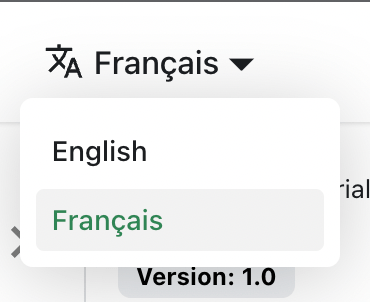

# 翻译你的网站

让我们将 `docs/intro.md` 翻译成法语。

## 配置 i18n

修改 `docusaurus.config.js` 以添加对 `fr` 区域的支持：

```js title="docusaurus.config.js"
export default {
  i18n: {
    defaultLocale: 'en',
    locales: ['en', 'fr'],
  },
};
```

## 翻译一个文档

将 `docs/intro.md` 文件复制到 `i18n/fr` 文件夹中：

```bash
mkdir -p i18n/fr/docusaurus-plugin-content-docs/current/

cp docs/intro.md i18n/fr/docusaurus-plugin-content-docs/current/intro.md
```

在法语中翻译 `i18n/fr/docusaurus-plugin-content-docs/current/intro.md`。

## 开始你的本地化网站

在法语区域开始你的网站：

```bash
npm run start -- --locale fr
```

你的本地化网站在 [http://localhost:3000/fr/](http://localhost:3000/fr/) 可用，并且 `Getting Started` 页面已被翻译。

:::caution

在开发过程中，你只能使用一种语言。

:::

## 添加一个语言下拉菜单

为了无缝地跨语言导航，添加一个语言下拉菜单。

修改 `docusaurus.config.js` 文件：

```js title="docusaurus.config.js"
export default {
  themeConfig: {
    navbar: {
      items: [
        // highlight-start
        {
          type: 'localeDropdown',
        },
        // highlight-end
      ],
    },
  },
};
```

语言下拉菜单现在出现在你的导航栏中：



## 构建你的本地化网站

为特定区域构建你的网站：

```bash
npm run build -- --locale fr
```

或者一次性包含所有区域构建你的网站：

```bash
npm run build
```
