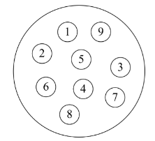
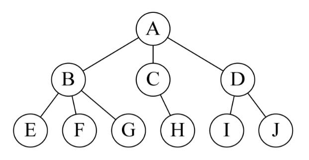
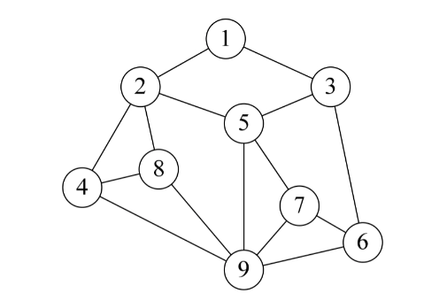
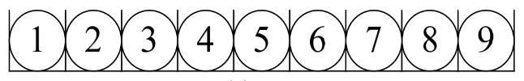
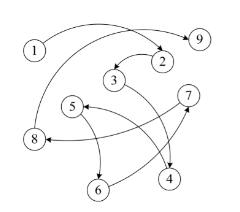

## 1. 定义
数据结构：是相互之间存在 `一种或多种特定关系` 的数据元素的集合

## 2. 分类
按照视点的不同，我们把数据结构分为 `逻辑结构` 和 `物理结构`
- **逻辑结构**：数据对象中数据元素之间的 `相互关系`
- **物理结构/存储结构**：数据的逻辑结构在计算机中的 `存储形式`

### 2.1 逻辑结构

#### （1）集合结构
数据元素之间除了 `属于同一个集合` 的关系外，每个元素之间是平等的，别无其他关系 

#### （2）线性结构
数据元素之间存在 `一对一` 的关系 

#### （3）树形结构
数据元素之间存在 `一对多` 的关系 

#### （4）图形结构
数据元素之间存在 `多对多` 的关系 

:::tip 注意
- 将每一个数据元素看做一个结点，用圆圈表示
- 元素之间的逻辑关系用结点之间的连线表示，如果这个关系是有方向的，那么用带箭头的连线表示  
- A 指向 B，那么 A 就是 B 的前驱，B 就是 A 的后继
:::

### 2.2 物理结构/存储结构

#### （1）顺序存储结构

- 定义：把数据元素存放在地址连续的存储单元里，数据元素之间的逻辑关系和物理关系是一致的
- 优点：可以实现随机存取，即通过首地址和元素序号可以在时间 O(1) 内找到指定的元素
- 缺点：插入和删除操作需要移动大量元素，平均时间复杂度为 O(n)

#### （2）链式存储结构

- 定义：把数据元素存放在任意的存储单元里，这组存储单元可以是连续的，也可以是不连续的
- 优点：插入和删除操作不需要移动大量元素，平均时间复杂度为 O(1)
- 缺点：不能实现随机存取，即通过首地址和元素序号不能在时间 O(1) 内找到指定的元素

:::tip 注意
- 顺序存储结构和链式存储结构是两种不同的存储方式
- 顺序存储结构是一种线性存储方式，链式存储结构是一种非线性存储方式
- 顺序存储结构的存储密度高，链式存储结构的存储密度低
:::

## 3. 算法
一般讲到数据结构，都会提到算法。起码要知道算法的定义和特性，以及算法的设计要求和效率的度量方法，具体看 [算法-概述](../算法/概述.md)

## 4. 结尾
数据结构的基本概述就到这里了，下一篇文章介绍常用数据结构。