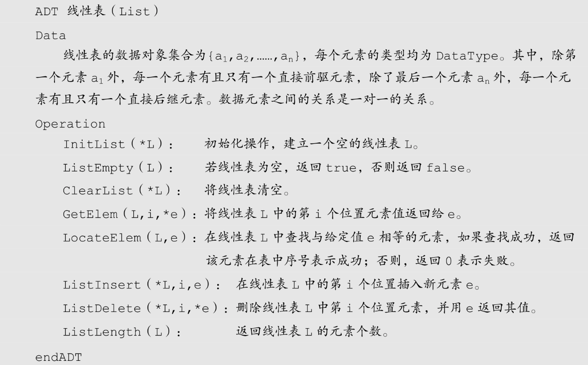
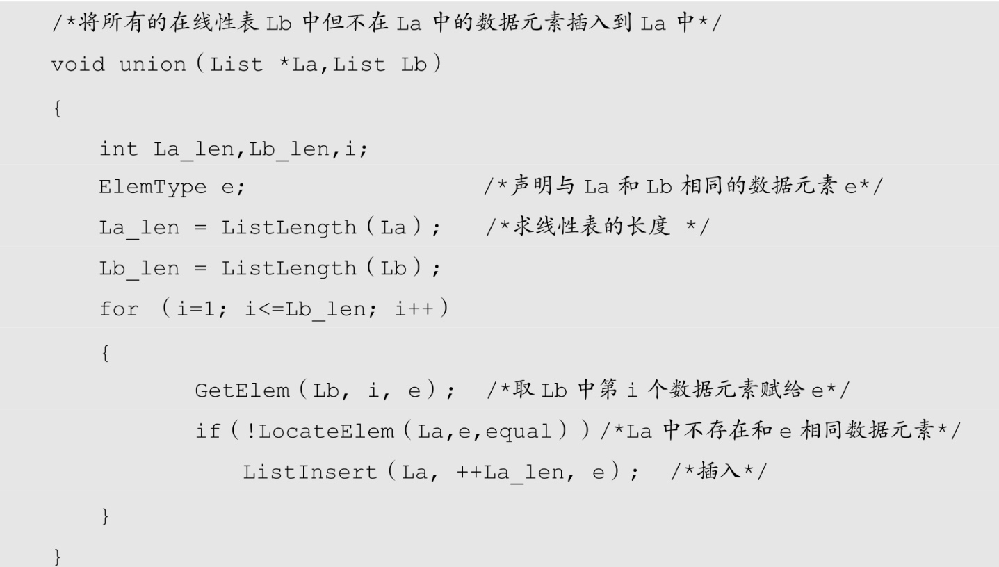

## 1. 定义
零个或多个数据元素的有限序列

:::tip 注意
- 元素之间是有顺序的
- 若元素存在多个，则第一个数据元素没有前驱，最后一个数据元素没有后继，其他数据元素都有唯一的前驱和后继
:::

## 2. 线性表的抽象数据类型

线性表的抽象数据类型定义如下:

对于不同的应用，线性表的基本操作是不同的，上述操作是最基本的，对于实际问题中涉及的关于线性表的更复杂操作，完全可以用这些基本操作的组合来实现。

举例：实现两个线性表集合A和B的并集操作。即要使得集合A=A∪B。说白了，就是把存在集合B中但并不存在A中的数据元素插入到A中即可

