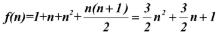

## 1. 定义
算法：是解决特定问题求解步骤的描述，在计算机中表现为指令的有限序列，并且每条指令表示一个或多个操作<br/>
:::tip 注意
- 算法定义中，提到了指令，指令能被人或机器等计算装置执行。它可以是计算机指令，也可以是我们平时的语言文字。
- 为了解决某个或某类问题，需要把指令表示成一定的操作序列，操作序列包括一组操作，每一个操作都完成特定的功能，这就是算法了。
:::


## 2. 特性
  - **输入**：算法具有 0 个或多个输入
  - **输出**：算法至少有 1 个或多个输出
  - **有穷性**：算法在执行有限的步骤之后，自动结束而不会出现无限循环，并且每一个步骤在可接受的时间内完成
  - **确定性**：算法的每一步都有确定的含义，不会出现二义性
  - **可行性**：算法的每一步都必须是可行的，也就是说，每一步都能够通过执行有限次数完成


## 3. 算法设计的要求
  - 正确性：算法的正确性是指算法至少应该具有输入、输出和加工处理无歧义性、能正确反映问题的需求、能够得到问题的正确答案
  - 可读性：算法设计的另一目的是为了便于阅读、理解和交流
  - 健壮性：当输入数据不合法时，算法也能做出相关处理，而不是产生异常或莫名其妙的结果
  - 时间效率高和存储量低：设计算法应该尽量满足时间效率高和存储量低的需求
  - 效率与低存储量需求是矛盾的，因此一般情况下，算法的效率和存储量都需要进行权衡
  - 设计算法要尽量满足实用需求，而不是设计出最优算法

## 4. 算法效率的度量方法

### 4.1 事后统计方法
通过设计好的测试程序和数据，利用计算机计时器对不同算法编制的程序的运行时间进行比较，从而确定算法效率的高低

:::tip 缺点
- 必须先依据算法的实现编制好程序才能进行运行，然后才能对运行时间进行比较，成本较高
- 时间的比较依赖于计算机的硬件、软件等环境因素，有时会掩盖算法本身的优劣
- 算法的测试数据设计困难，并且程序的运行时间往往与测试数据的规模有很大关系，效率高的算法在小的测试数据面前可能无法体现出优势<br/>
- 通常不用这种方法进行算法的评价
:::


### 4.2 事前分析估算方法
在计算机程序编制前，依据统计方法对算法进行估算，一般一个用高级程序语言编写的程序在计算机上运行时所消耗的时间取决于下列因素:
- 算法采用的策略、方法
- 编译产生的代码质量
- 问题的输入规模
- 机器执行指令的速度

:::tip 
- 抛开这些与计算机硬件、软件有关的因素，一个程序的运行时间，依赖于 `算法的好坏` 和 `问题的输入规模`，所谓问题输入规模是指输入量的多少
- 事前分析估算方法主要是通过分析算法的 `时间复杂度` 和 `空间复杂度` 来判断算法的效率
:::


## 5. 复杂度

### 5.1 时间复杂度
#### （1）定义
在进行算法分析时，语句总的执行次数 **T(n)** 是关于问题规模n的函数，进而分析 **T(n)** 随 **n** 的变化情况并确定 **T(n)** 的数量级。算法的时间复杂度，也就是算法的时间量度，记作：**T(n) = O(f(n))**。它表示随问题规模 **n** 的增大，算法执行时间的增长率和 **f(n)** 的增长率相同，称作算法的渐近时间复杂度，简称为时间复杂度。其中 **f(n)** 是问题规模n的某个函数。

:::tip
- T(n) 表示算法中 **语句总执行次数**，是一个关于问题规模n的函数。例如：对于双重循环的算法，T(n) 可能为 `n^2 + n + 1`
- f(n) 是描述 T(n) 增长速度的函数。例如：当 `T(n)= n^2 + n + 1` 时，取最高阶项 `n^2`，则 `f(n)=n^2`，时间复杂度为 O(n^2)
- 这样用大写O( )来体现算法时间复杂度的记法，我们称之为大O记法。
:::

#### （2）推导大O阶方法
- 用常数1取代运行时间中的所有加法常数
- 在修改后的运行次数函数中，只保留最高阶项。
- 如果最高阶项存在且不是1，则去除与这个项相乘的常数

最终得到的结果就是大O阶。


#### （3）常数阶
```c
    int sum = 0,n = 100;    /* 执行一次 */
    sum = （1+n）*n/2;      /* 执行一次 */
    printf（"%d", sum）;    /* 执行一次 */
```

上面的算法中，执行的次数为 3，用大O表示就是 O(1)

:::warning
为什么不是 O(3)，而是 O(1)？

- 这个算法的运行次数函数是f（n）=3。根据我们推导大O阶的方法，第一步就是把常数项3改为1。在保留最高阶项时发现，它根本没有最高阶项，所以这个算法的时间复杂度为O(1)。

- 不管这个常数是多少，我们都记作O(1)，而不能是O(3)、O(12)等其他任何数字，这是初学者常常犯的错误
:::


#### （4）线性阶
```c
    int i;
    for(i=0; i<n; i++) {
        /* 时间复杂度为 O(1) 的程序步骤序列 */
    }
```
线性阶的循环结构会复杂很多。要确定某个算法的阶次，我们常常需要确定某个特定语句或某个语句集运行的次数。因此，我们要分析算法的复杂度，关键就是要分析循环结构的运行情况。

上面的算法中，执行的次数为 n，用大O表示就是 `O(n)`，因为循环体中的代码须要执行n次。

#### （5）对数阶
```c
    int count = 1;
    while(count < n) {
        count = count * 2;
        /* 时间复杂度为 O(1) 的程序步骤序列 */
    }
```
由于每次count乘以2之后，就距离n更近了一分。也就是说，有多少个2相乘后大于n，则会退出循环。由2^x=n得到x=log2n。所以这个循环的时间复杂度为O(logn)。

#### （6）平方阶
```c
    int i, j;
    for(i=0; i<n; i++) {
        for(j=0; j<n; j++) {
            /* 时间复杂度为 O(1) 的程序步骤序列 */
        }
    }
```
上面的算法中，执行的次数为 n^2，用大O表示就是 `O(n^2)`，因为循环体中的代码须要执行n^2次。

所以我们可以总结得出，循环的时间复杂度等于循环体的复杂度乘以该循环运行的次数。

```c
    int i,j;
    for（i = 0; i < n; i++）{
        for （j = i; j < n; j++）{  /* 注意j = i而不是0 */
            /* 时间复杂度为O(1)的程序步骤序列 */
        }
    }
```

由于当i=0时，内循环执行了n次，当i=1时，执行了n－1次，……当i=n－1时，执行了1次。所以总的执行次数为：


用我们推导大O阶的方法，第一条，没有加法常数不予考虑；第二条，只保留最高阶项，因此保留n2/2；第三条，去除这个项相乘的常数，也就是去除1/2，最终这段代码的时间复杂度为O(n2)。

继续看例子，对于方法调用的时间复杂度又如何分析

```c
    int i,j;
    for（i = 0; i < n; i++）{
        function（i）;
    }

    void function（int count）{
        print（count）;
    }
```

函数体是打印这个参数。其实这很好理解，function函数的时间复杂度是O(1)。所以整体的时间复杂度为O(n)

假如function是下面这样的：
```c
    void function（int count）{
        int j;
        for （j = count; j < n; j++）{
            /* 时间复杂度为O(1)的程序步骤序列 */
        }
    }
```

这和刚才举的例子i、j是一样的，只不过把嵌套内循环放到了函数中，所以最终的时间复杂度为O(n2)。

下面这段相对复杂的语句：
```c
    n++;                                      /* 执行次数为1 */
    function（n）;                            /* 执行次数为n */
    int i,j;
    for（i = 0; i < n; i++）{                 /* 执行次数为n2 */
          function （i）;
    }
    for（i = 0; i < n; i++）{                 /* 执行次数为n（n + 1）/2 */
          for （j = i;j < n; j++）{
                /* 时间复杂度为O(1)的程序步骤序列 */
          }
    }
```

它的执行次数为：，根据推导大O阶的方法，最终这段代码的时间复杂度也是O(n2)。


#### (7) 常见的时间复杂度


常用的时间复杂度所耗费的时间从小到大依次是：


#### （8）最坏时间复杂度
算法完成工作最多需要多少基本操作，即最坏情况下的时间复杂度。

最坏情况运行时间是一种保证，那就是运行时间将不会再坏了。在应用中，这是一种最重要的需求，通常，除非特别指定，我们提到的运行时间都是最坏情况的运行时间。

#### （9）平均时间复杂度
算法完成工作平均需要多少基本操作，即平均情况下的时间复杂度。

#### （10）最好时间复杂度
算法完成工作最少需要多少基本操作，即最好情况下的时间复杂度。

### 5.2 空间复杂度：
算法的空间复杂度通过计算算法所需的存储空间实现，算法空间复杂度的计算公式记作：S(n)=O(f(n))，其中，n为问题的规模，f(n)为语句关于n所占存储空间的函数。


### 6. 常用算法：
- 贪心算法：
- 分治法：
- 动态规划算法：
- 回溯算法：
- 分支界限算法：
- 随机算法：
- 启发式算法：
- 模拟算法：
- 逼近算法：
- 迭代算法：
- 穷举算法：
- 搜索算法：
- 排序算法：
    - 插入排序：
    - 直接插入排序：
    - 折半插入排序：
    - 希尔排序：
    - 交换排序：
    - 冒泡排序：
    - 快速排序：
    - 选择排序：
    - 简单选择排序：
    - 堆排序：
    - 归并排序：
    - 基数排序：
- 查找算法：
  - 顺序查找：
  - 折半查找：
  - 插值查找：
  - 斐波那契查找：
  - 二叉排序树查找：
  - 平衡二叉树查找：
  - 散列表查找：
  - 哈希查找：
  - 分块查找：
- 压缩算法：
- 加密算法：
- 哈希算法：
- 编码算法：