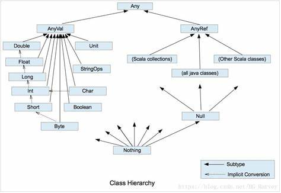

# Scala 基础语法

## 前置知识：JAVA 数据类型
在深入了解 Scala 数据类型之前，先回顾一下 JAVA 数据类型：
- **基本类型**：byte、short、int、long、float、double、boolean
- **基本类型的包装类型**：Byte、Short、Integer、Long、Float、Double、Boolean、Character
- **引用类型**：对象类型

:::note
以上是 JAVA 中数据类型的基本分类，为理解 Scala 数据类型提供基础。
:::

## 一、Scala 数据类型

### （一）整体总结
Scala 具有独特的数据类型体系，其中一切数据类型都是对象，且均为 `Any` 的子类。Scala 数据类型主要分为两大类：
- **数值类型（AnyVal）**：包含各种基本数值类型。
- **引用类型（AnyRef）**：类似于 Java 中的引用类型。

:::info[补充]
无论是数值类型还是引用类型，在 Scala 中都是对象。
:::

Scala 数据类型遵循低精度数值类型向高精度数值类型的自动转换（隐式转换）规则。同时，`StringOps` 是对 Java 中 `String` 类型的增强。另外，`Unit` 对应 Java 中的 `void` 关键字，表示没有返回值，且 `Unit` 是一个数据类型，只有一个对象 `()`；`Null` 也是一个类型，仅有一个对象 `null`，它是所有引用类型 `AnyRef` 的子类；`Nothing` 是所有数据类型的子类，常用于函数没有明确返回值的情况，可将其返回值赋给任何变量或函数。



### （二）整数类型
#### 1. 整型分类
| 数据类型 [字节] | 描述                                                         |
| :---------------: | :------------------------------------------------------------: |
| Byte [1]        | 8 位有符号补码整数，数值区间为 -128 ~ 127（-2^7 ~ 2^7 - 1）      |
| Short [2]       | 16 位有符号补码整数，数值区间为 -32768 ~ 32767（-2^15 ~ 2^15 - 1） |
| Int [4]         | 32 位有符号补码整数，数值区间为（-2^31 ~ 2^31 - 1）             |
| Long [8]        | 64 位有符号补码整数，数值区间为（-2^63 ~ 2^63 - 1）             |

:::tip
- 2^10 = 1K
- 2^20 = 1M
- 2^30 = 1G
:::

### （三）浮点类型
#### 1. 浮点型分类
| 数据类型 [字节] | 描述                             |
| ----------------- | -------------------------------- |
| Float [4]         | 32 位，IEEE754 标准的单精度浮点数  |
| Double [8]        | 64 位 IEEE 754 标准的双精度浮点数 |

:::tip
在 Scala 中默认整数是 `Int` 类型，小数是 `Double` 类型。
:::

### （四）字符类型
- 字符类型用于表示单个字符，字符变量底层保存的是 ASCII 码。
```scala
val i1: Int = 'a'
println(i1) // 结果为 97

val i2: Char = (i1 + 1).toChar
println(i2)	//结果为b
```

### （5）布尔类型

- Boolean类型的数值只有true和false
- Boolean类型只占1个字节

### （6）Unit类型、Null类型、Nothing类型

| 数据类型 | 描述                                                         |
| -------- | ------------------------------------------------------------ |
| Unit     | 空值，表示数值类型中的空值，用于表示不返回任何结果的方法的返回类型，Unit只有一个实例值：（） |
| Null     | 空引用，表示引用类型中的空值。Null类型只有一个实例值null     |
| Nothing  | Nothing类型处于Scala类型的最底层，它是任何类型的子类型。当我们确定一个函数没有正常的返回值类型时，可以使用Nothing来指定返回值的类型，这样我们就可以把返回的值（异常）赋值给其他函数或者变量（兼容性） |


## 二、类型转换

### （一）数值类型自动转换
当 Scala 程序进行赋值或者运算时，精度小的类型会自动转换成精度大的数值类型，此为自动类型转换。具体规则如下：
- **自动提升规则**：多种类型的数据进行混合运算时，系统会先将所有数据自动转换成精度大的数据类型，然后再进行计算。
- **赋值规则**：把精度大的数值类型赋值给精度小的数据类型时会报错；反之则会进行自动类型转换。
- **特殊规则**：`Byte`、`Short` 和 `Char` 之间不会自动转换，但三者之间可以进行计算，计算时会转换成 `Int` 类型。

:::tip
当 `Byte` 类型和 `Short` 类型相加时，返回值是 `Int`。
:::

### （二）强制类型转换
强制类型转换一般用于将数据从高精度转换为低精度，需注意以下几点：
- 强转只针对于最近的操作数，可使用小括号提升优先级。
- 强转时可能会造成精度丢失或者溢出。

常见的强制转换方法有：
- `.toByte`
- `.toShort`
- `.toInt`
- `.toLong` 
- `.toChar`

### （三）数值类型和 String 类型间的转换
此处暂未详细展开，后续可补充具体的转换方法和示例。

## 三、运算符
运算符部分暂未详细阐述，后续可补充 Scala 中各类运算符的使用方法和示例。

## 四、流程控制
流程控制部分暂未详细介绍，后续可补充 Scala 中如 `if-else`、`for` 循环、`while` 循环等流程控制语句的使用。