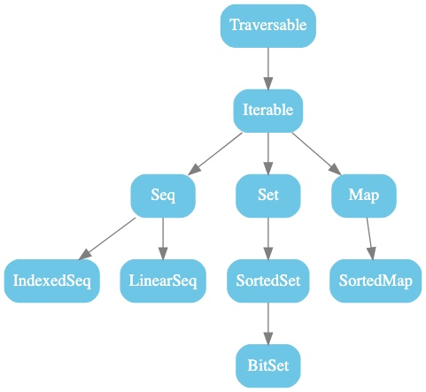
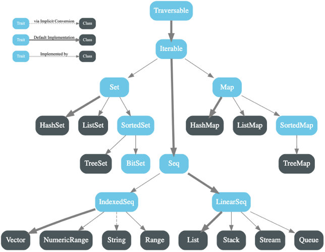
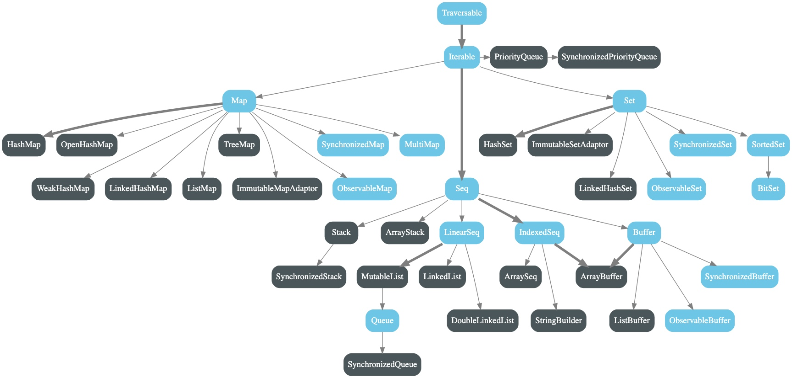

# 前言
在 Scala 编程中，容器是非常重要的概念，它提供了多种数据结构来存储和操作数据。理解不同类型的容器及其特点，有助于我们更高效地编写 Scala 代码。

# Collection （容器）

---

- 根据中元素的`组织方式`和`操作方式`，Scala 中的容器 Collection 可以分为有序和无序容器、可变和不可变等不同的容器类别。

- Scala 用了三个包来组成容器类：

  - **scala.collection**

  - **scala.collection.mutable**

    *包含了所有`可变`的容器（例：可变集合、可变映射）*

  - **scala.collection.immutable**

    *包含了所有`不可变`的容器（可变集合、可变映射）*

<!-- more -->

- 组织关系图

  - 下图显示了 scala.collection 包中所有的容器类。

    > 这些都是`高级抽象类`或`特质`。例如，所有容器的基本特质（trait）是 Traverable 特质。它为所有的容器定义了公用的 foreach 方法，用于对容器元素进行遍历操作

    
  
- 下图显示了 scala.collection.immutable（`不可变`）包中所有的容器类
  
  
  
- 下图显示了 scala.collection.mutable（`可变`）中的所有容器类
  
  
  

## 1. 列表（List）

---

列表是一种共享相同类型的`不可变`的对象序列，Scala 的 List 定义在 scala.collection.immutable 包中

```scala
var strList = List("Bigdata", "Hadoop", "Spark")
```

:::tip
1. 不同于 Java 的 java.util.List，scala 的 List 一旦被定义其值就不能改变了，因此声明 List 时必须初始化！
2. 这里用 var 声明不是说声明的 List 类型的 strList 是可变的，而是指向是可变的
:::

基本知识：

- 列表有头部和尾部的概念，可以分别使用 head 和 tail 方法来获取
- head 返回的是列表第一个元素的值
- tail 返回的是除第一个元素外的其他值构成的新列表（这里体现出列表具有 递归 的 链表结构 ）

```scala
var strList = List("Bigdata", "Hadoop", "Spark")
  
// 下面表达式返回“Bigdata”
var str = strList.head
  
// 下面表达式返回 List(“Hadoop”, "Spark")
val list = strList.tail
```

## 2. 集合（Set）
集合是一种不包含重复元素的容器。Scala 中的集合分为可变集合和不可变集合，分别位于 scala.collection.mutable 和 scala.collection.immutable 包中。

### 不可变集合
```scala
import scala.collection.immutable.Set

// 创建一个不可变集合
val immutableSet = Set(1, 2, 3)

// 添加元素，会返回一个新的集合
val newImmutableSet = immutableSet + 4

// 打印集合
println(immutableSet) // 输出: Set(1, 2, 3)
println(newImmutableSet) // 输出: Set(1, 2, 3, 4)
 ```

### 可变集合
```scala
import scala.collection.mutable.Set

// 创建一个可变集合
val mutableSet = Set(1, 2, 3)

// 添加元素
mutableSet += 4

// 移除元素
mutableSet -= 2

// 打印集合
println(mutableSet) // 输出: Set(1, 3, 4)
 ```

## 3. 映射（Map）
映射是一种键值对的容器，键是唯一的。Scala 中的映射也分为可变映射和不可变映射，分别位于 scala.collection.mutable 和 scala.collection.immutable 包中。

### 不可变映射
```scala
import scala.collection.immutable.Map

// 创建一个不可变映射
val immutableMap = Map("one" -> 1, "two" -> 2, "three" -> 3)

// 获取值
val value = immutableMap("two")

// 添加键值对，会返回一个新的映射
val newImmutableMap = immutableMap + ("four" -> 4)

// 打印映射
println(immutableMap) // 输出: Map(one -> 1, two -> 2, three -> 3)
println(newImmutableMap) // 输出: Map(one -> 1, two -> 2, three -> 3, four -> 4)
```

### 可变映射
```scala
import scala.collection.mutable.Map

// 创建一个可变映射
val mutableMap = Map("one" -> 1, "two" -> 2, "three" -> 3)

// 添加键值对
mutableMap += ("four" -> 4)

// 移除键值对
mutableMap -= "two"

// 修改值
mutableMap("one") = 10

// 打印映射
println(mutableMap) // 输出: Map(one -> 10, three -> 3, four -> 4)
```

## 4. 迭代器（Iterator）
迭代器是一种用于遍历容器元素的工具。通过迭代器，我们可以依次访问容器中的每个元素。

```scala
val list = List(1, 2, 3, 4, 5)
val iterator = list.iterator

// 使用 while 循环遍历迭代器
while (iterator.hasNext) {
  println(iterator.next())
}

// 使用 for 循环遍历迭代器
val iterator2 = list.iterator
for (elem <- iterator2) {
  println(elem)
}
 ```

## 5. 数组（Array）
数组是一种固定大小的容器，用于存储相同类型的元素。Scala 中的数组是可变的。

```scala
// 创建一个长度为 3 的整数数组
val array = new Array[Int](3)

// 初始化数组元素
array(0) = 1
array(1) = 2
array(2) = 3

// 访问数组元素
val element = array(1)

// 打印数组元素
for (i <- 0 until array.length) {
  println(array(i))
}
 ```

## 6. 元组（Tuple）
元组是一种可以包含不同类型元素的容器，元组的长度是固定的。

```scala
// 创建一个元组
val tuple = (1, "hello", true)

// 访问元组元素
val firstElement = tuple._1
val secondElement = tuple._2
val thirdElement = tuple._3

// 打印元组元素
println(firstElement) // 输出: 1
println(secondElement) // 输出: hello
println(thirdElement) // 输出: true
 ```